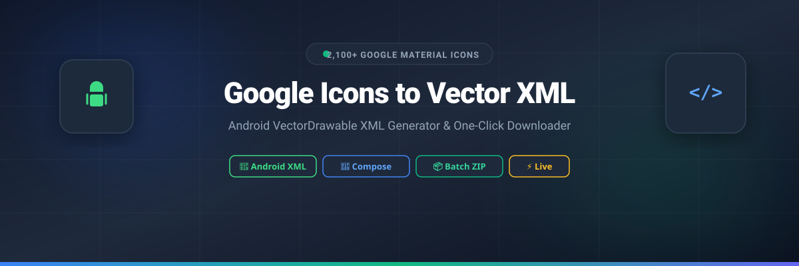

# 🎨 Google Icons to Vector XML

<p align="center">
  
</p>

<p align="center">
  <strong>The Ultimate Google Material Symbols & Icons Library with Instant Android VectorDrawable XML Generation.</strong>
</p>

<p align="center">
  <a href="https://github.com"></a>
  <a href="https://developer.android.com"></a>
  <a href="https://react.dev"></a>
  <a href="https://vite.dev"></a>
  <a href="https://tailwindcss.com"></a>
  <a href="LICENSE"></a>
</p>

---

## 🌟 Overview

**Google Icons to Vector XML** is an open-source web application designed for Android developers, UI/UX designers, and front-end engineers. It provides instant access to **2,120+ official Google Material Symbols & Icons** with real-time customization and production-ready Android VectorDrawable XML export capabilities.

Whether you're building traditional Android XML layouts or modern Jetpack Compose applications, this tool streamlines your icon workflow with smart search, batch export, and comprehensive customization options.

---

## ✨ Complete Features

### 🔍 **Smart Icon Search & Discovery**
- Access to **2,120+ Official Google Material Icons** indexed directly from Google Fonts metadata
- **Instant Fuzzy Search**: Fast client-side search by icon name, category, or semantic tags
  - Example: Searching *"heart"* finds `favorite`, *"gear"* finds `settings`, *"trash"* finds `delete`, *"bell"* finds `notifications`
- **Category Filters**: Browse icons by predefined categories (UI, Navigation, Communication, etc.)
- **Popular Tags**: Quick access to trending icon searches
- **Advanced Filtering**: Filter by icon style (Outlined, Rounded, Sharp, Filled)

### 🎨 **Customization Engine**
- **Style Variations**: Choose from 4 icon styles
  - Outlined (Thin stroke)
  - Rounded (Rounded corners)
  - Sharp (Angular edges)
  - Filled/Solid variants
- **Dimension Selector**: 
  - Standard sizes: 16dp, 20dp, 24dp
  - Extended sizes: 32dp, 48dp, 64dp
  - Custom size input support
- **Color Customization**:
  - Android color presets (`@android:color/black`, `@android:color/white`)
  - Theme attributes (`?attr/colorControlNormal`, `?attr/colorPrimary`)
  - Google brand colors palette
  - Custom hex color picker with real-time preview
- **Fill State Toggle**: Switch between Fill 0 (outline) and Fill 1 (filled)
- **Live Preview**: Real-time visual feedback with multiple background modes
  - Checkerboard background for transparency inspection
  - Light mode background for contrast checking
  - Dark mode background for night mode validation

### 📐 **Production-Ready Vector XML Export**
- **Standard Android Format**: Generates authentic `<vector>` drawables matching Android Studio's Vector Asset import format
- **Valid Resource Naming**: Automatic conversion to valid Android resource names (e.g., `ic_search.xml`)
- **PathData Optimization**: Clean, optimized SVG pathData for minimal file size
- **Comments & Documentation**: Generated XML includes dimensions and color attributes for easy reference

### 💾 **Multiple Export Options**
- **Single Icon Download**: Download individual `ic_name.xml` files
- **Copy to Clipboard**: 
  - Copy complete Vector XML code
  - Copy only pathData for manual integration
  - Copy Jetpack Compose code snippet
- **Batch ZIP Export**: 
  - Select multiple icons simultaneously
  - Download all selected icons in a `drawable/` directory structure
  - Ready to paste directly into Android project
- **SVG Export**: Export raw SVG files for use in Figma, Adobe XD, or web projects

### 🤖 **Android Integration Helpers**
- **XML Layout Snippets**: Ready-to-use `<ImageView>` code for traditional layouts
- **Jetpack Compose Snippets**: Pre-formatted `Icon()` composable code
- **Resource Reference Guide**: Instructions on how to reference drawables in code
- **Best Practices**: Tips for sizing, tinting, and using vector drawables in production

### 🌐 **Localization & Accessibility**
- **Bilingual Support**: Seamless toggle between English and বাংলা (Bengali)
  - All UI text translated
  - Icon search works in both languages
  - Dynamic language switching without page reload
- **Accessible UI**: 
  - Keyboard navigation support
  - Screen reader friendly
  - ARIA labels on interactive elements
  - High contrast support

### ⚡ **Performance Optimizations**
- **Client-Side Processing**: All operations run locally in your browser
- **Fast Fuzzy Search**: Instant results as you type
- **Lazy Loading**: Icons load on demand for better performance
- **Responsive Design**: Works seamlessly on desktop, tablet, and mobile devices
- **Modern UI Framework**: Built with React 19 concurrent rendering for smooth interactions

### 📊 **Batch Operations**
- **Multi-Select Mode**: Toggle select multiple icons at once
- **Floating Action Bar**: Quick actions for selected icons
- **Batch Customization**: Apply styles to all selected icons simultaneously
- **Smart Deselection**: Easy single/multiple deselection options
- **Selection Persistence**: Maintain selections while searching

### 📱 **Mobile-Friendly Interface**
- **Responsive Grid**: Adapts icon cards to screen size
- **Touch-Optimized**: Large tap targets for mobile devices
- **Touch-Friendly Modals**: Easy-to-use dialogs on all screen sizes
- **Mobile Search**: Optimized search experience on small screens

### 🎯 **Developer Features**
- **Copy to Clipboard**: One-click copy with visual feedback
- **Syntax Highlighting**: Code viewers with proper formatting
- **Error Messages**: Clear feedback for any operation
- **Quick Actions**: Right-click or quick menu options

---

## 🚀 Live Demo

Check out the live website deployed on GitHub Pages:

👉 **[https://muhammadshihablbl-commits.github.io/google-icons-to-vector-xml/](https://muhammadshihablbl-commits.github.io/google-icons-to-vector-xml/)**

*(Note: First load may take a moment as it downloads the complete Google Icons metadata)*

---

## 📱 How to Use Generated Vector XML in Android

### 1. Download or Copy XML
Select any icon from the library, customize its size, color, and style, then click:
- **Download XML** to save as `ic_name.xml`, or
- **Copy XML** to copy the complete code, or
- **Copy PathData** to copy just the path for manual editing

### 2. Add to Android Project
Paste the downloaded file into your Android Studio project at:
```text
your-app/
└── app/
    └── src/
        └── main/
            └── res/
                └── drawable/
                    └── ic_search.xml   <-- Paste here
```

### 3. Reference in UI

#### 🔹 XML Layout (`res/layout/activity_main.xml`):
```xml
<ImageView
    android:layout_width="24dp"
    android:layout_height="24dp"
    android:src="@drawable/ic_search"
    android:contentDescription="Search Icon"
    android:tint="?attr/colorControlNormal" />
```

#### 🔹 Jetpack Compose (Kotlin):
```kotlin
Icon(
    painter = painterResource(id = R.drawable.ic_search),
    contentDescription = "Search Icon",
    modifier = Modifier.size(24.dp),
    tint = MaterialTheme.colorScheme.onSurface
)
```

#### 🔹 Android DataBinding:
```xml
<ImageView
    android:layout_width="24dp"
    android:layout_height="24dp"
    android:src="@drawable/ic_search"
    android:tint="@{viewModel.iconTintColor}" />
```

---

## 🛠️ Tech Stack

| Technology | Purpose |
| :--- | :--- |
| **React 19** | Modern declarative UI with concurrent rendering for smooth interactions |
| **TypeScript** | Strict type safety and robust data structures across the codebase |
| **Vite 6** | Ultra-fast build tool and blazingly fast dev server with HMR |
| **Tailwind CSS v4** | Modern utility-first styling with `@theme` token integration |
| **Google Fonts API** | Real-time SVG assets fetched from `fonts.gstatic.com` |
| **JSZip** | Client-side compression for batch ZIP exports without server |
| **Lucide Icons** | Clean, consistent UI icons throughout the application |
| **Motion** | Smooth animations and transitions for polish |

---

## 💻 Local Development Setup

Follow these steps to run the project locally on your computer:

```bash
# 1. Clone the repository
git clone https://github.com/muhammadshihablbl-commits/google-icons-to-vector-xml.git

# 2. Navigate to project folder
cd google-icons-to-vector-xml

# 3. Install dependencies
npm install

# 4. Start the development server
npm run dev
```

Open [http://localhost:3000](http://localhost:3000) in your browser.

The app will automatically reload when you make changes to the source files.

### 📦 Build for Production

```bash
npm run build
```

This generates optimized static assets in the `dist/` directory ready for deployment.

### 🚀 Deploy to GitHub Pages

After building, the generated files in `dist/` are ready to deploy:

#### Option 1: Manual Deployment
```bash
# Build the project
npm run build

# Add dist folder to git tracking
git add dist/

# Commit the build
git commit -m "Deploy: Build files for GitHub Pages"

# Push to GitHub
git push origin main
```

#### Option 2: Automated CI/CD
Set up GitHub Actions (workflow file included in `.github/workflows/`):
1. Go to **Repository Settings** → **Pages**
2. Set **Source** to "Deploy from a branch"
3. Select **Branch**: `main` and **Folder**: `/dist`
4. Every push to main automatically builds and deploys

#### Option 3: GitHub Pages Settings
1. Go to **Settings** → **Pages**
2. Select source branch and folder
3. Configure custom domain (optional)
4. Enable HTTPS (recommended)

---

## 📂 Project Structure

```text
├── public/
│   ├── banner.svg                    # Hero banner image for documentation
│   └── data/
│       └── icons.json                # 2,120+ indexed Google Icons metadata
├── src/
│   ├── components/
│   │   ├── Header.tsx                # App navigation, theme toggle, language switch
│   │   ├── SearchBar.tsx             # Live search, category pills & popular tags
│   │   ├── IconCard.tsx              # Single icon card with quick action buttons
│   │   ├── IconGrid.tsx              # Responsive paginated grid with lazy loading
│   │   ├── XmlDetailModal.tsx        # Full Vector XML code viewer & customizer
│   │   ├── BatchDownloadModal.tsx    # Batch ZIP exporter and multi-select handler
│   │   ├── BatchActionBar.tsx        # Floating multi-select action toolbar
│   │   ├── HelpModal.tsx             # Android Studio usage instructions
│   │   └── StyleCustomizer.tsx       # Color, size, and style picker component
│   ├── utils/
│   │   ├── vectorXml.ts              # SVG to Android VectorDrawable converter
│   │   ├── iconSearch.ts             # Fuzzy search and filtering logic
│   │   └── clipboardUtils.ts         # Cross-browser clipboard operations
│   ├── types.ts                      # Shared TypeScript definitions and interfaces
│   ├── i18n.ts                       # Internationalization (English, Bengali)
│   ├── App.tsx                       # Main application controller
│   ├── main.tsx                      # React entry point
│   └── index.css                     # Global styles & Google Fonts imports
├── .github/
│   └── workflows/
│       └── deploy.yml                # Automated GitHub Pages CI/CD workflow
├── vite.config.ts                    # Vite configuration with React plugin
├── tsconfig.json                     # TypeScript compiler options
├── tailwind.config.js                # Tailwind CSS configuration
├── package.json                      # Project dependencies and scripts
└── index.html                        # HTML entry point
```

---

## 🎯 Use Cases

### For Android Developers
- 📱 Quick access to Material Design icons without Vector Asset import dialog
- ⚡ Batch download icons for complete feature sets
- 🎨 Real-time customization matching your app's design system
- 📋 Copy ready-to-use XML or Compose code

### For UI/UX Designers
- 🖌️ Export icons in multiple styles for design systems
- 📊 Consistent icon sizing and naming conventions
- 🌈 Color customization for brand guidelines
- 📁 Batch export for design tools (SVG format)

### For Front-End Engineers
- 🌐 Use SVG exports in web applications
- 📦 Optimize icon loading with batch downloads
- 🎨 Customize icons to match web design systems
- 💾 Version control icon assets in Git

---

## 🔄 Updates & Roadmap

- ✅ Full Google Material Symbols catalog (2,120+ icons)
- ✅ Batch export with ZIP generation
- ✅ Multiple export formats (XML, SVG, PNG)
- ✅ Bilingual interface (English & Bengali)
- 🚧 Custom icon upload (planned)
- 🚧 Icon animation presets (planned)
- 🚧 Figma plugin integration (planned)

---

## 📄 License & Attribution

- **Icons**: Sourced from **[Google Fonts Material Symbols](https://fonts.google.com/icons)** and licensed under the **[Apache License 2.0](https://www.apache.org/licenses/LICENSE-2.0)**.
- **Web Application**: Licensed under the **MIT / Apache-2.0 License**.
- **Third-party Libraries**: See `package.json` for complete attribution.

---

## 🤝 Contributing

Contributions are welcome! Here's how you can help:

1. Fork the repository
2. Create your feature branch (`git checkout -b feature/AmazingFeature`)
3. Commit your changes (`git commit -m 'Add AmazingFeature'`)
4. Push to the branch (`git push origin feature/AmazingFeature`)
5. Open a Pull Request

---

## 📞 Support & Feedback

- 🐛 **Found a bug?** Open an [issue](https://github.com/muhammadshihablbl-commits/google-icons-to-vector-xml/issues)
- 💡 **Have a feature request?** Share your ideas in [discussions](https://github.com/muhammadshihablbl-commits/google-icons-to-vector-xml/discussions)
- ⭐ **Like this project?** Consider giving it a star on GitHub!

---

<p align="center">
  Made with ❤️ for Android Developers, Designers & Open Source Community
</p>

<p align="center">
  <strong>⭐ If you found this helpful, please star the repository! ⭐</strong>
</p>
